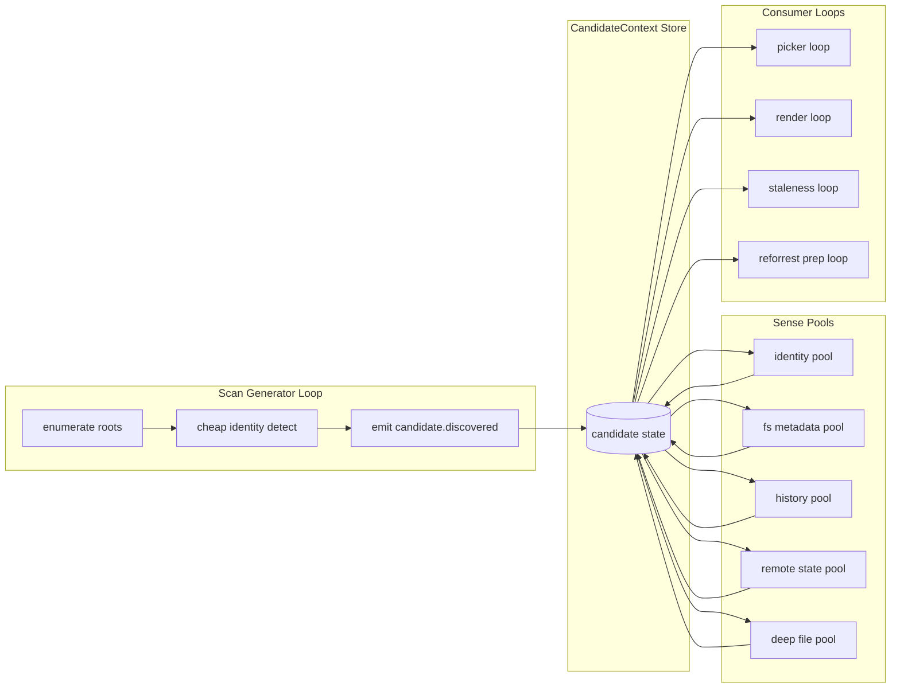

# Demand-Driven Sense Loops for `is-tree`

This document links the `is-tree` scan/picker work to the loop architecture in [`rektide/iso-chill` `doc/design.md`](https://github.com/rektide/iso-chill/blob/main/doc/design.md), especially:

- [The Loop System](https://github.com/rektide/iso-chill/blob/main/doc/design.md#the-loop-system)
- [Queue](https://github.com/rektide/iso-chill/blob/main/doc/design.md#queue)
- [SignalEvent](https://github.com/rektide/iso-chill/blob/main/doc/design.md#signalevent)
- [Control Loop Design](https://github.com/rektide/iso-chill/blob/main/doc/design.md#control-loop-design)

Related local docs:

- [`/doc/pick-iter.md`](/doc/pick-iter.md)
- [`/doc/planner-pushdown.md`](/doc/planner-pushdown.md)

## Intent

Move from one-shot "scan everything, compute everything" execution to a looped model:

- `scan` is a generator loop that emits candidates quickly.
- downstream loops are consumers with explicit demands.
- sensing pools fulfill those demands at the right cost tier.

Instead of hardcoding one runtime path, we declare process demands and let a sense planner satisfy them.

## Why this model fits

The `iso-chill` model gives us three useful ideas to borrow directly:

1. **Consumer-initiated subscriptions**: producers do not need to know all consumers.
2. **Shared state + signal events**: events coordinate; state is source of truth.
3. **Micro-batched loop ticks**: good traceability, bounded work, easier tuning.

For `is-tree`, this means scan can emit candidate references, while multiple consumers (picker, staleness view, renderer, sync planner) independently subscribe and ask for more detail only when needed.

## Core model

### Candidate context store

Maintain a shared per-path context store, analogous to `ProcessContext` in `iso-chill`.

Each candidate keeps:

- `directory` identity
- known columns (`status`, `change-date`, `ahead`, ...)
- freshness timestamps per column
- in-flight demand state

### Signal events

Loops emit small events (not full payload copies), such as:

- `candidate.discovered`
- `candidate.updated(column=change-date)`
- `candidate.ready(demand=picker.fast)`

Consumers react to events, then read required data from the shared store.

### Sense pools

A sense pool is a loop (or strategy set) that can fill a class of columns.

Initial pools:

- **identity pool**: `status`, `directory`, worktree/basic type
- **fs metadata pool**: `change-date`, directory mtime, file-count-lite
- **history pool**: `commit-date`
- **remote state pool**: `ahead`
- **deep file pool**: per-file age/size/modified (future `--files`)

Pools run on demand, not eagerly for all candidates.

## Demand declarations

Each process declares what it needs as a demand contract.

Example schema:

```rust
struct Demand {
    id: String,
    columns: Vec<String>,
    max_staleness: std::time::Duration,
    priority: u8,
    max_candidates: Option<usize>,
    ordering: Vec<SortKey>,
}
```

Examples:

- `picker.fast`
  - columns: `directory`, `status`, `change-date`
  - priority: high
  - ordering: `change-date-`
- `render.detail`
  - columns: full format projection
  - priority: medium
- `stale.files`
  - columns: `directory`, per-file age columns
  - priority: low

The planner computes the minimal pool work needed to satisfy active demands.

## Loop topology



## How this changes `--scan`

`--scan` becomes the primary candidate-generator loop, not a one-off mode.

- It emits candidates immediately from cheap detection.
- It can apply early ordering (`directory`, `change-date`) when available.
- It does not wait for expensive pools.

Then downstream consumers trigger deeper sensing for selected candidates only.

Pipeline intent remains:

```bash
is-tree --scan --format directory | fuzzel --dmenu --multi | is-tree --stdin --format all
```

But internally this is not "run two unrelated commands"; it is two demand profiles over the same sensing model:

- first command asks for `picker.fast`
- second command asks for `render.detail` on a reduced candidate set

## Planning rules (demand-first)

1. Union active demand columns.
2. Determine cheapest pool set that can satisfy union.
3. Execute pools in stage order (cheap to expensive).
4. Emit events as each demand reaches readiness.
5. Recompute when demand set changes (new consumer, canceled consumer, narrowed candidate set).

This generalizes pushdown from static CLI parsing to live loop operation.

## Practical example

### Step 1: picker demand

Consumer requests:

- columns: `directory`, `status`, `change-date`
- ordering: `change-date-`
- target: first 200 candidates quickly

Planner schedules:

- scan loop + identity pool + fs metadata pool
- no history/remote/deep pools yet

### Step 2: user selects 8 paths

Renderer requests:

- columns: `status`, `directory`, `commit-date`, `ahead`
- scope: selected 8 paths

Planner schedules:

- history + remote pools, but only for selected 8

This is where the large performance win comes from.

## Minimal implementation path

1. Keep current CLI behavior and planner from [`/doc/planner-pushdown.md`](/doc/planner-pushdown.md).
2. Add a small in-memory candidate store abstraction.
3. Introduce one event channel and one consumer loop (`picker.fast`).
4. Split existing probes into pool-like executors with declared column coverage.
5. Expand to multiple consumer loops and scoped demand recomputation.

## Design constraints

- Preserve Unix composability at the CLI surface.
- Keep deterministic output for non-streaming commands.
- Make pool scheduling observable (debug logs per demand and pool run).
- Avoid hidden expensive upgrades unless policy explicitly allows it.

## Decision

Adopt a demand-driven sense-loop architecture:

- scan loop generates candidates
- consumers declare demands
- sense pools fulfill demands by cost tier

This ties `is-tree` directly to proven `iso-chill` loop patterns while staying focused on repository candidate generation and selective deep inspection.
