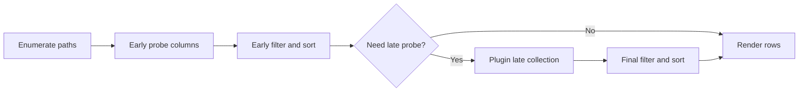

# Flowline: Phase 2 Staged Runtime Design

Plan name: **Flowline**.

Flowline is Phase 2 of the planner/pushdown roadmap from [`/doc/planner-pushdown.md`](/doc/planner-pushdown.md). It consumes Seedling planner outputs and executes queries in staged runtime order.

Related references:

- [`/doc/planner-pushdown.md`](/doc/planner-pushdown.md)
- [`/doc/plan/seedling-phase-1-query-planner.md`](/doc/plan/seedling-phase-1-query-planner.md)
- [`/doc/pick-iter.md`](/doc/pick-iter.md)
- [`/src/main.rs`](/src/main.rs)
- [`/src/plugin.rs`](/src/plugin.rs)

## Why this phase exists

Seedling can tell us what work is needed and when it is available. Flowline makes runtime follow that plan so early columns are computed and emitted before expensive columns.

This is the phase that turns planning into user-visible speed improvements.

## Goals

- Execute query work in explicit stages.
- Support early streaming when plan allows.
- Apply early filters/sorts before late probes.
- Keep full-mode correctness equivalent to current behavior.
- Route directory-only optimization through planner output, not bespoke branch logic.

## Non-goals

- No plugin metadata API changes yet (still use planner metadata map).
- No per-file recursion implementation yet.
- No long-running daemon behavior.

## Runtime stage model

## Proposed module layout

Create a runtime domain with stage-specific units:

- `src/runtime/mod.rs` — execution entrypoint
- `src/runtime/enumerate.rs` — path enumeration and base row init
- `src/runtime/early.rs` — early probe and early predicate/sort application
- `src/runtime/late.rs` — plugin streaming/merge for late columns
- `src/runtime/render.rs` — text/json rendering adapters

Planner integration:

- `src/main.rs` builds `LogicalQuery` and `PhysicalPlan`, then calls `runtime::execute(plan, args)`.

## Execution contract

`runtime::execute` consumes:

- `PhysicalPlan` (from Seedling)
- parsed CLI flags
- plugin registry

It returns a fully rendered output side effect (stdout/stderr) with the same user-visible semantics as current runtime.

## Stage behavior details

### Stage 1: Enumerate

- Build candidate path list from positional args or `--all` roots.
- Initialize row records with `directory` column available.
- If plan is `FastPath::DirectoryOnly`, render immediately and return.

### Stage 2: Early probe

- Compute early columns only (`status`, `change-date`, etc.) for surviving rows.
- Apply early-eligible filters.
- Apply early sort keys.
- If plan supports streaming, emit rows progressively.

### Stage 3: Late probe (conditional)

- Run plugin streaming only if `plan.needs_late_probe`.
- Request only late-required columns from the registry.
- Merge patches into existing rows.

### Stage 4: Finalize + render

- Apply deferred filters and final sort keys.
- Render text/json through existing formatting semantics.

## Scan policy integration

Flowline introduces policy handling for scan mode with late requirements:

- `upgrade` (default): execute late stage to preserve correctness.
- `defer`: skip late stage, warn on stderr, render early-only results.
- `error`: fail with actionable message listing unsupported keys.

Policy should be pluggable in runtime config so future flags can expose it.

## Compatibility expectations

- Existing non-scan commands produce equivalent results as before.
- Existing format and json rendering stay stable.
- Existing plugin toggles and plugin-selected columns continue to work.

## Acceptance criteria

- Runtime executes through staged entrypoint for all command paths.
- `FastPath::DirectoryOnly` uses planner decision and preserves current directory-only output semantics.
- Early-stage query shapes avoid late probe/plugin collection.
- Mixed-stage queries still produce correct final ordering and output.
- Scan mode obeys selected late-key policy (`upgrade`/`defer`/`error`).
- Text and JSON output remain compatible with current format semantics.

## Verification

- Integration tests for staged vs baseline equivalence:
  - `--all --format all`
  - `--all --format "{status} {directory}"`
  - `--all --format directory`
  - `--all --json --format "{directory} {status}"`
- Policy tests for scan mode:
  - scan + early-only keys
  - scan + late keys under each policy
- Performance checks on large directory sets to confirm reduced late probe work.

## Risks and mitigations

- **Risk:** staged sort behavior differs from one-shot sort.
  - **Mitigation:** enforce stable sort semantics and add deterministic order tests.
- **Risk:** filter placement bugs leak/omit rows.
  - **Mitigation:** explicit stage-tagged filter evaluation tests.
- **Risk:** runtime complexity increases maintenance cost.
  - **Mitigation:** domain-grouped runtime modules with narrow responsibilities.

## Done when

Flowline is complete when runtime follows planner stage decisions end-to-end, delivering early responsiveness for scan-friendly queries while preserving full-mode correctness and output compatibility.
